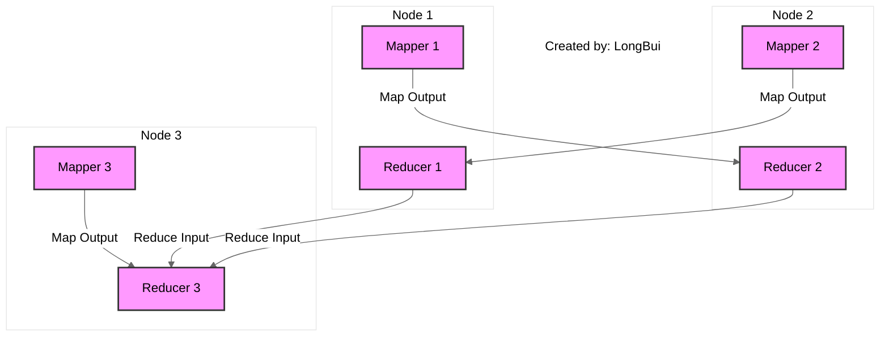
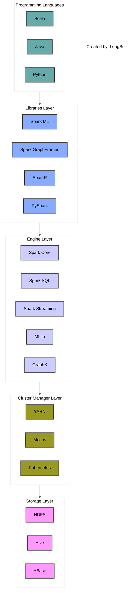

# Batch Processing

Internal source notes for the public Datacamping page about Spark-based batch processing.

## Page intent

The page introduces batch processing through Apache Spark.

Its structure combines:

- a quick conceptual introduction
- Spark installation pointers
- execution model vocabulary
- DataFrame and RDD examples
- `inferSchema`
- Spark cluster concepts
- deployment and triggering ideas

## Page outline

The public page includes these major sections:

- Introduction
- Installation
- Application Components in Spark
- Spark SQL and DataFrames
- Explanation of `inferSchema`
- Spark Internals
- Wide Transformation and Narrow Transformation
- GroupBy in Spark
- Joins in Spark
- Spark Job Runs - Deployment Mode
- Spark Component
- Anatomy of a Spark Cluster
- Trigger Spark Job
- Further Discussion

## Intro framing

The page defines batch processing as handling a large dataset at a point in time, where processing can take:

- minutes
- or even hours

It positions Spark as the most common framework for this style of work.

## Spark vs MapReduce framing

The page describes Spark's goal as preserving the distributed and fault-tolerant benefits of MapReduce while making development and execution easier.

Advantages called out on the page include:

- faster execution through in-memory caching and parallel processing
- multi-threaded JVM execution
- richer functional programming models
- strong community support

## Installation and startup

The page points readers toward official installation guidance and also shows a `spark-shell` startup example.

### Example command

```bash
spark-shell
```

The shell output shown by the page highlights:

- local mode
- the Spark Web UI
- a working Spark context
- a working Spark session

## Spark execution vocabulary

The page defines:

- application
- job
- stage
- task

### Summary preserved from the page

- application: contains a main entry point
- job: created when an action is triggered
- stage: split around shuffle boundaries
- task: the smallest execution unit, typically based on partitions

## DataFrame and RDD example

The page uses taxi data as the working example.

```python
import pyspark
from pyspark.sql import SparkSession

spark = (
    SparkSession.builder
    .appName("dec")
    .config("spark.executorEnv.PYSPARK_PYTHON", "/opt/homebrew/lib/python3.10/")
    .config("spark.executorEnv.PYSPARK_DRIVER_PYTHON", "/opt/homebrew/lib/python3.10/site-packages/pyspark/")
    .getOrCreate()
)

df_green = spark.read.parquet("data/stg/green/*/*")
print("Row Counts: ", df_green.count())

rdd = df_green.select("lpep_pickup_datetime", "PULocationID", "total_amount").rdd
subset_rdd = rdd.filter(lambda row: int(row["PULocationID"]) != 74)
```

## `inferSchema`

The page explains that Spark can infer column types automatically when reading CSV files.

Example shown:

```python
df = spark.read.format("csv").option("inferSchema", "true").load("path/to/csv/file.csv")
```

### Benefits called out on the page

- automatic type assignment
- faster setup for large datasets
- less manual schema work during exploration

### Disclaimer called out on the page

The page also warns that inferred schemas may be wrong when:

- data is inconsistent
- values are missing

And it recommends explicit schemas with `StructType` when correctness matters.

## Simple map and reduce example

The page uses a low-level RDD aggregation example.

```python
def map_function(row):
    return (row.PULocationID, row.total_amount)

mapped_rdd = subset_rdd.map(map_function)

def reduce_function(amount1, amount2):
    return amount1 + amount2

reduced_rdd = mapped_rdd.reduceByKey(reduce_function)
```

## Warehouse connector example

The page also shows Spark talking to Snowflake and running a count against `WAREHOUSE.PUBLIC.WEB_EVENTS`.

This is important because it teaches that Spark is not isolated from the rest of the data stack.

## Mermaid diagrams preserved from the page

### Spark internals diagram



### Spark component diagram



## What the page is really teaching

The page gives learners a practical Spark mental model:

1. start a Spark runtime
2. read a dataset
3. inspect the data
4. transform with DataFrame or RDD APIs
5. understand execution through jobs, stages, and tasks
6. connect Spark to another system when needed

## Useful takeaways for the skill pack

- Start with DataFrames and use RDDs mainly when teaching execution flow or low-level transformations.
- Use `inferSchema` for learning, not as a blind production default.
- Explain partitions, shuffles, and stages early because they drive cost and performance.
- Show Spark as part of the wider data stack, not as a standalone island.
