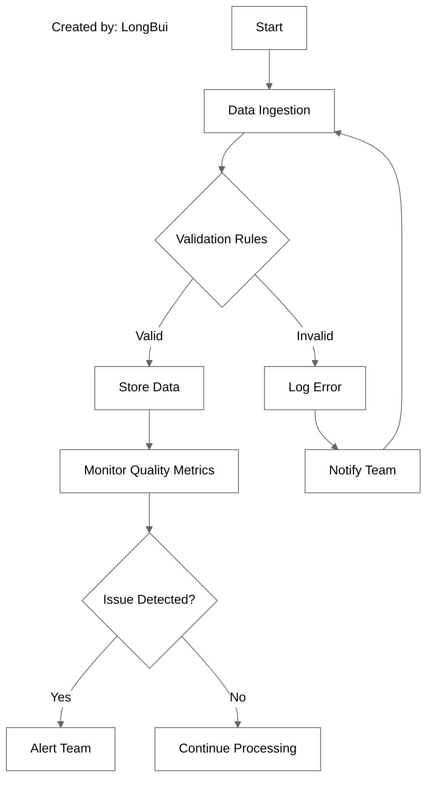
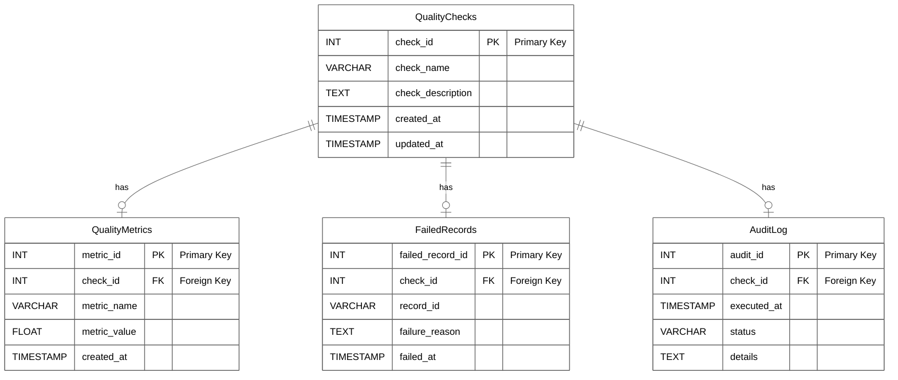

# Data Quality

Internal source notes for the public Datacamping page about data quality.

## Page intent

This page is the most operationally detailed source in the Datacamping sequence.

It teaches data quality through:

- quality dimensions
- validation
- cleaning
- monitoring
- schema design
- metrics and rules
- Snowflake
- dbt
- Deequ

## Quality definition

The page defines data quality as the condition of a dataset according to factors such as:

- accuracy
- completeness
- consistency
- reliability
- relevance

It explicitly ties data quality to decision-making, efficiency, and trust.

## Key dimensions preserved from the page

- accuracy
- completeness
- consistency
- timeliness
- validity
- integrity

Each is described as a distinct aspect of whether data can be trusted and used safely.

## Validation

The page introduces validation as checking data against predefined rules before it is processed or stored.

### Python example preserved from the page

```python
import re

def validate_email(email):
    pattern = r"[^@]+@[^@]+\\.[^@]+"
    return re.match(pattern, email) is not None

def validate_transaction(transaction):
    if not transaction.get("transaction_id"):
        raise ValueError("Missing transaction_id")
    if not transaction.get("amount") or transaction["amount"] <= 0:
        raise ValueError("Invalid amount")
    if not validate_email(transaction.get("customer_email")):
        raise ValueError("Invalid customer_email")
    return True
```

## Cleaning

The page follows validation with a basic cleaning example in `pandas`.

### Cleaning operations preserved from the page

- drop rows with missing `transaction_id`
- replace negative amounts with null
- fill missing amounts with the median
- null out invalid emails

### Example

```python
df.dropna(subset=["transaction_id"], inplace=True)
df["amount"] = df["amount"].apply(lambda x: x if x >= 0 else None)
df["amount"].fillna(df["amount"].median(), inplace=True)
df["customer_email"] = df["customer_email"].apply(
    lambda x: x if isinstance(x, str) and validate_email(x) else None
)
```

## Monitoring

The page makes the case for continuous monitoring, not just one-time validation.

It includes:

- completeness monitoring
- dashboarding ideas
- data-quality flowchart concepts
- quality metrics over time

### Example completeness function

```python
def monitor_completeness(df, column_name):
    total_records = len(df)
    missing_records = df[column_name].isnull().sum()
    completeness_percentage = ((total_records - missing_records) / total_records) * 100
    return completeness_percentage
```

### Monitoring flowchart preserved from the page



## Metrics and rules

The page explains that quality requires both:

- metrics to quantify quality
- rules to decide whether the quality is acceptable

Examples preserved from the page include:

- completeness thresholds
- accuracy thresholds
- timeliness calculations

### SQL examples preserved from the page

```sql
SELECT
    (COUNT(*) - COUNT(NULLIF(column_name, NULL))) / COUNT(*) * 100 AS completeness_percentage
FROM table_name;
```

```sql
SELECT
    COUNT(*) AS total_records,
    SUM(CASE WHEN column_name = expected_value THEN 1 ELSE 0 END) / COUNT(*) * 100 AS accuracy_percentage
FROM table_name;
```

```sql
SELECT AVG(TIMESTAMPDIFF(HOUR, collection_time, available_time)) AS avg_timeliness
FROM table_name;
```

## Schema design

The page explicitly proposes a schema for tracking quality over time.

Entities called out on the page:

- `QualityChecks`
- `QualityMetrics`
- `FailedRecords`
- `AuditLog`

The page explains that these structures help capture:

- metadata about checks
- metric results
- failing records
- execution details

### Schema diagram preserved from the page



## Snowflake implementation

The page includes a Snowflake table for logging quality results.

```sql
CREATE TABLE data_quality_results (
    check_name STRING,
    check_date TIMESTAMP,
    check_status STRING,
    failed_records INT,
    total_records INT,
    error_message STRING
);
```

It also sketches a stored procedure for running the checks:

```sql
CREATE OR REPLACE PROCEDURE run_data_quality_checks()
RETURNS STRING
LANGUAGE SQL
AS
$$
BEGIN
    -- Completeness Check
    -- Accuracy Check
    RETURN 'Data Quality Checks Completed';
END;
$$;
```

## dbt implementation

The page uses dbt to express rules declaratively.

### Examples preserved from the page

```yaml
tests:
  - name: no_nulls
    columns:
      - name: column_name
        tests:
          - not_null
```

```yaml
tests:
  - name: valid_values
    columns:
      - name: status
        tests:
          - accepted_values:
              values: ["pending", "completed", "failed"]
```

```bash
dbt test
```

## Deequ implementation

The page also shows Deequ for profiling and verification in Spark contexts.

### Example analyzers

```python
analysisResult = AnalysisRunner(spark) \
    .onData(df) \
    .addAnalyzer(Size()) \
    .addAnalyzer(Completeness("Zone")) \
    .addAnalyzer(Distinctness("Zone")) \
    .addAnalyzer(Distinctness("service_zone")) \
    .addAnalyzer(Completeness("service_zone")) \
    .addAnalyzer(Compliance("LocationID", "LocationID >= 0.0")) \
    .run()
```

### Example verification

```python
checkResult = VerificationSuite(spark) \
    .onData(df) \
    .addCheck(
        check.hasSize(lambda x: x >= 3000)
        .isContainedIn("service_zone", ["Zone1", "Zone2", "Zone3"])
        .isUnique("Zone")
        .isComplete("service_zone")
        .isComplete("Zone")
    ).run()
```

## What the page is really teaching

This page treats quality as an operating layer that spans the stack:

- Python validation before or during ingestion
- cleaning for recoverable issues
- metric-based monitoring over time
- warehouse audit tables
- dbt publish gates
- Deequ for profiling and verification

## Useful takeaways for the skill pack

- Treat data quality as a system, not a single test.
- Separate metrics from rules and from execution history.
- Use explicit audit storage for failed checks and failed records.
- Combine simple warehouse checks, dbt tests, and richer profiling tools when needed.
