# Stream Processing

Internal source notes for the public Datacamping page about Kafka and stream processing.

## Page intent

The page introduces stream processing through Kafka and its ecosystem.

It is organized around:

- Kafka fundamentals
- ecosystem components
- schema management
- stream-processing applications
- Kafka Connect and KSQL
- late-arriving data
- local startup
- partition and consumer sizing

## Opening framing

The page defines Kafka as an open-source distributed event-streaming platform designed for:

- high throughput
- low latency
- large-scale real-time data handling

It positions Kafka as a core technology for modern data-engineering projects.

## Ecosystem overview

The page emphasizes that Kafka is not only a broker.

It presents an ecosystem view that includes:

- producers
- consumers
- brokers
- topics
- partitions
- Kafka Streams
- Kafka Connect
- KSQL

## Kafka basics preserved from the page

### Core building blocks

- producers publish to topics
- consumers read from topics
- brokers store and serve data
- topics organize records
- partitions provide parallelism

### Type distinction mentioned on the page

- batch query / message-per-second style operations
- stream query / transaction-per-second style operations

## Schema management

The page uses Avro plus a schema registry framing.

### Key ideas preserved from the page

- schema evolution becomes difficult at scale
- compatibility matters when schemas change
- central schema management helps preserve integrity
- Avro is useful when systems need compact serialization and evolving schemas

## Real-time applications

The page introduces Kafka Streams as a client library for real-time applications and microservices.

Important ideas called out on the page include:

- stream logic can become complex quickly
- stateful operations need planning
- Kafka Streams provides a DSL API
- KStreams and KTables are core abstractions

## Late data and event-time thinking

The page puts real emphasis on late-arriving data.

This is important because it moves the lesson beyond simple "messages go through Kafka" thinking.

Themes preserved from the page:

- windowing
- event-time processing
- reprocessing
- late-arriving records as a normal production concern

## Local startup commands

The page includes a small local bootstrap path.

```bash
docker-compose up
```

```bash
kafka-topics --version
```

```bash
kafka-topics --create --topic streamPayment --bootstrap-server localhost:9092 --partitions 2
```

```bash
kafka-topics --list --bootstrap-server localhost:9092 | grep Payment
```

## Example topic from the page

The named example topic is:

- `streamPayment`

This gives the lesson a concrete artifact for learners to interact with.

## Mermaid diagrams preserved from the page

### Kafka ecosystem overview

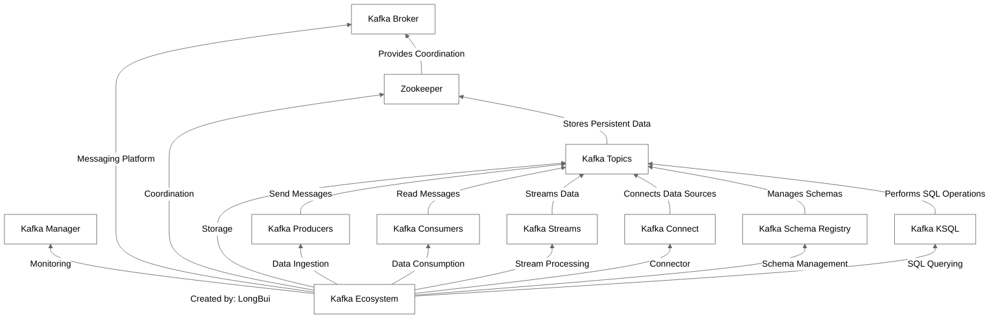

### Kafka use cases in data engineering

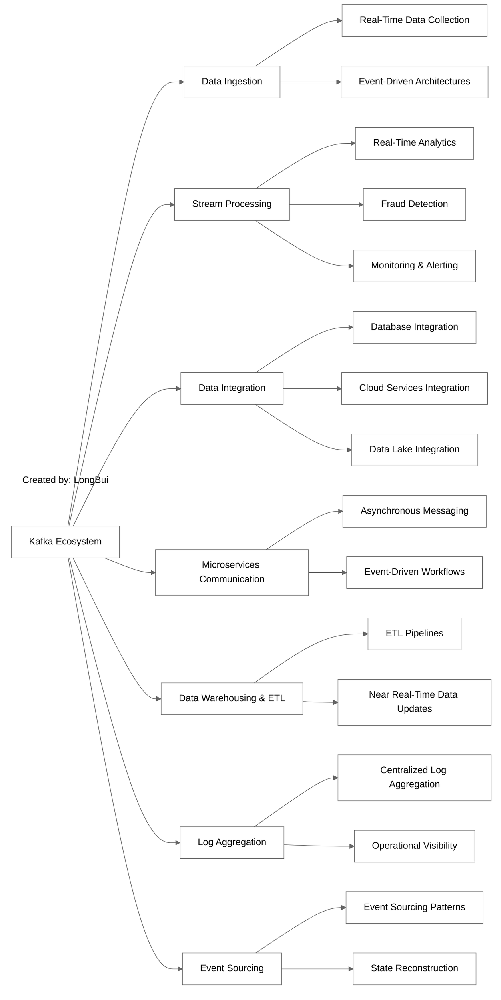

### Producer, broker, and consumer relationship

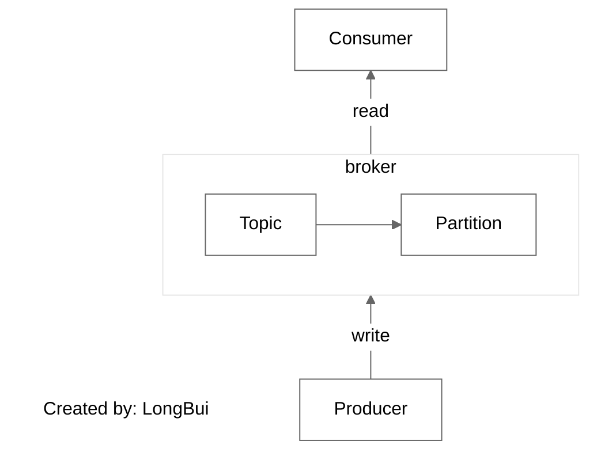

### Schema management mindmap

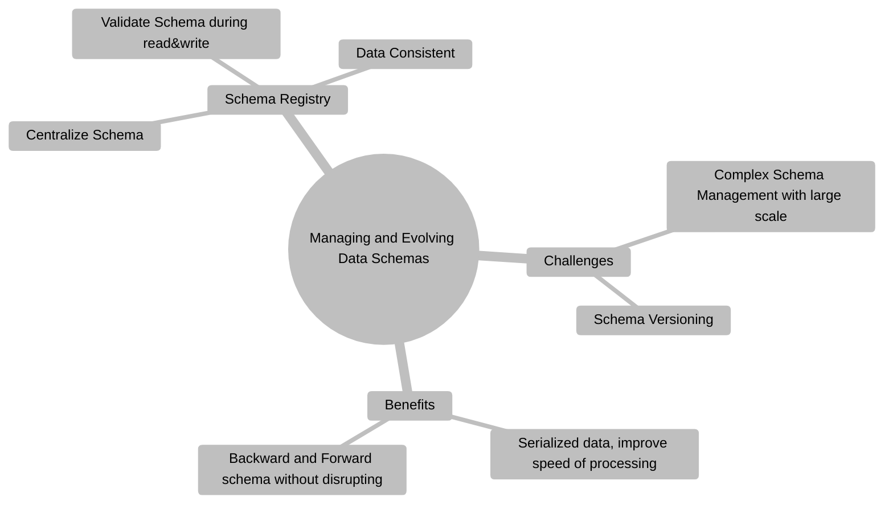

### Real-time application mindmap

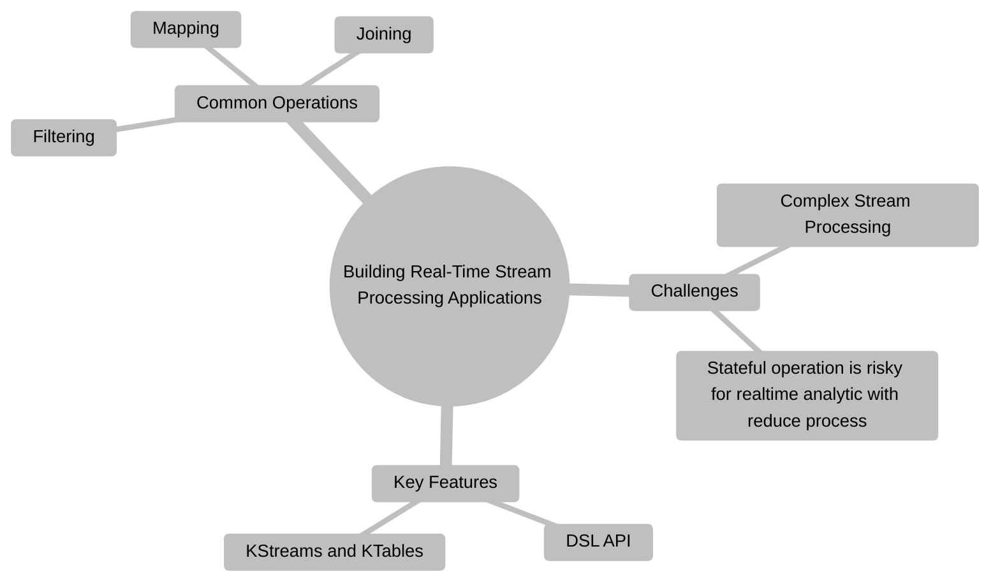

### Connect and KSQL mindmap

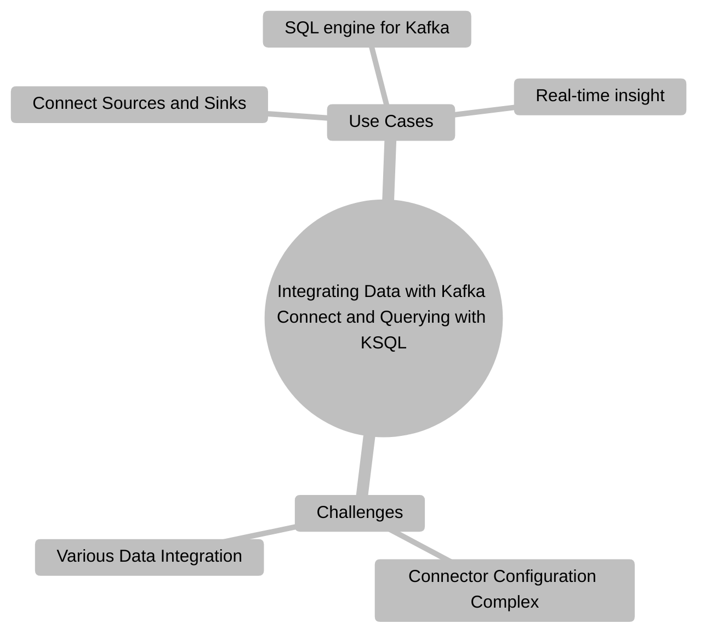

### Streaming processing mindmap

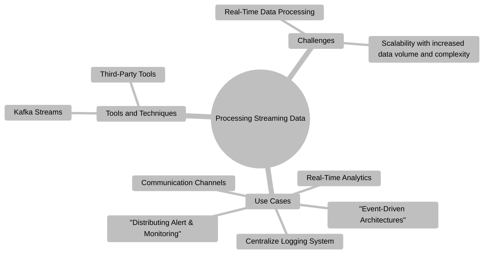

### Late-data handling mindmap

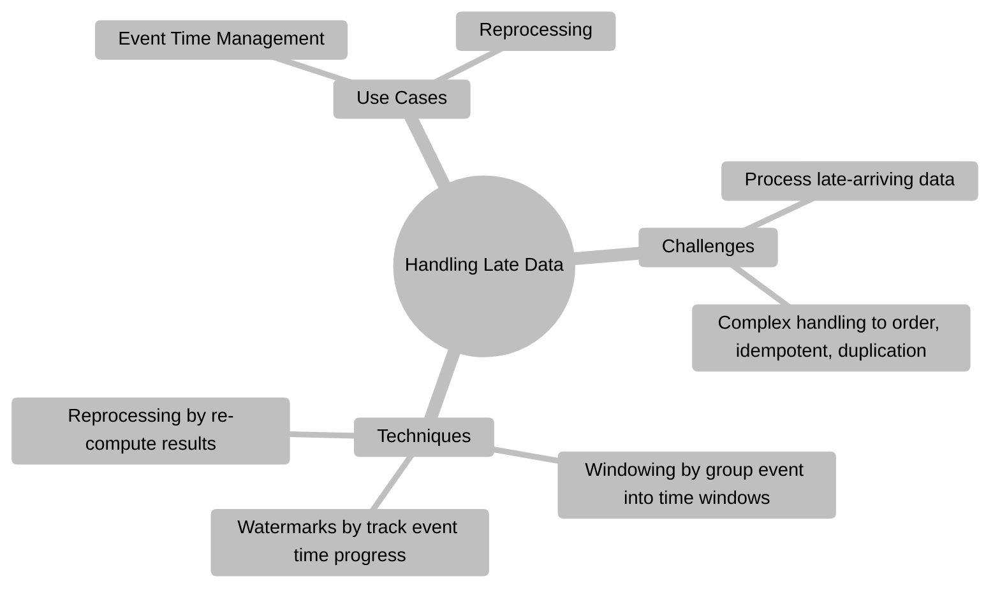

### Windowing example

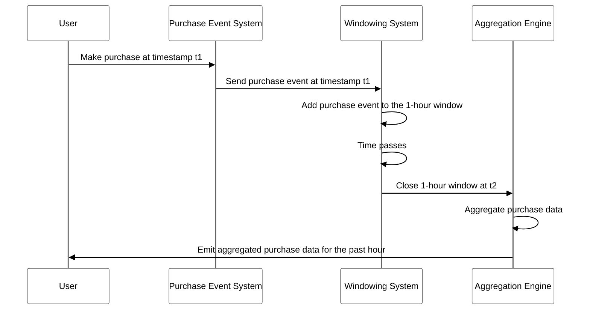

### Watermark example

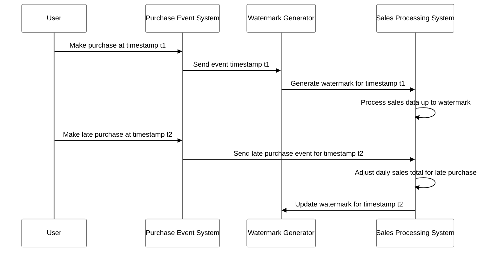

### Reprocessing example

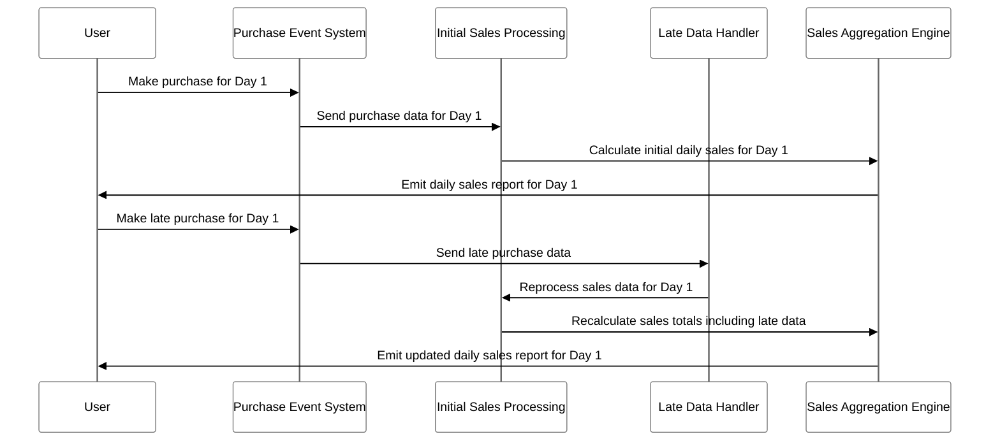

### Partition and consumer sizing example

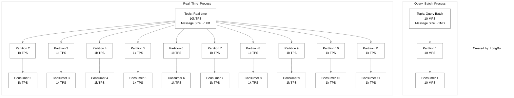

## What the page is really teaching

The page is less about one long code lab and more about operating principles for stream systems:

1. define the event flow
2. model schemas carefully
3. choose the right Kafka ecosystem tool
4. handle late data explicitly
5. size partitions and consumers based on actual workload

## Useful takeaways for the skill pack

- Teach stream systems through event-time, partitions, and schema evolution, not only through broker commands.
- Use a local topic-creation flow to make Kafka concrete.
- Treat late data as a first-class design problem.
- Keep the decision boundary clear between batch needs and streaming needs.
